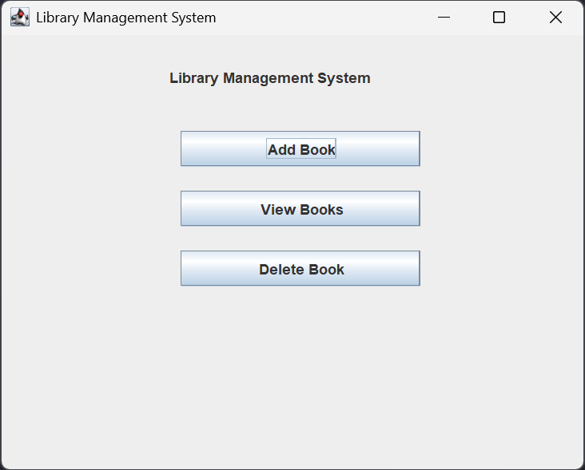
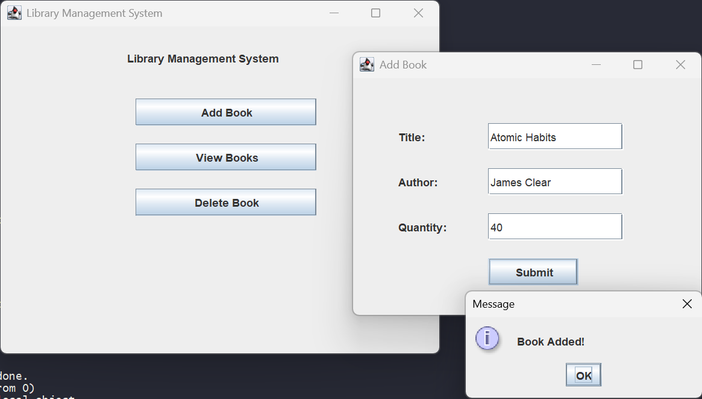
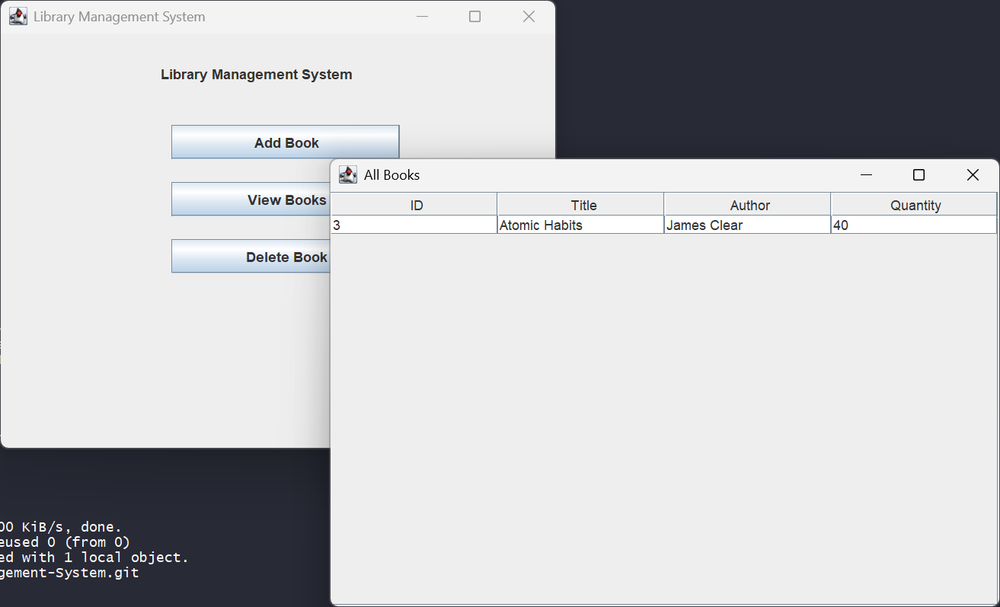
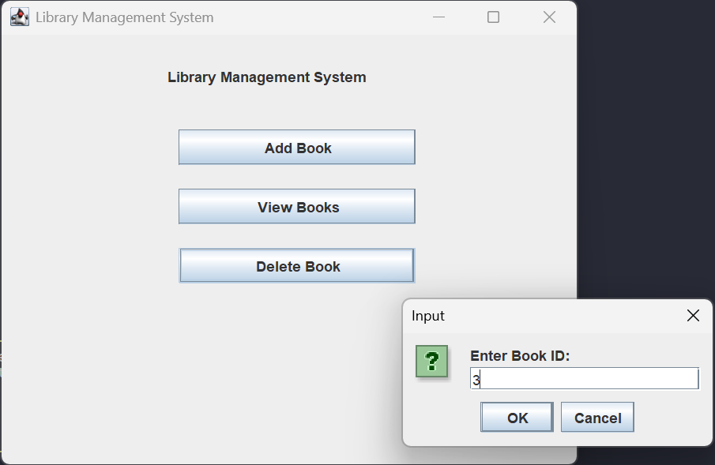
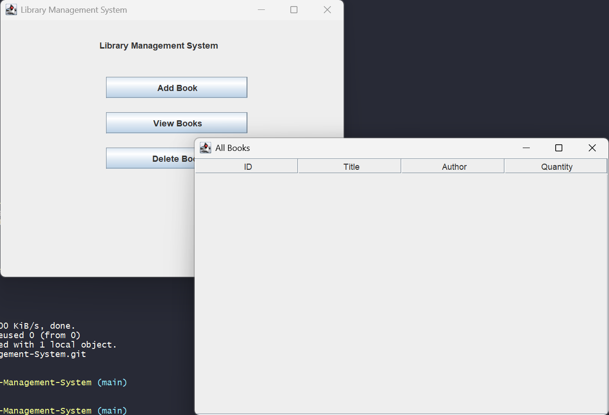

# Library Management System (Java Swing + JDBC)

A desktop-based **Library Management System** built with **Java Swing**, **JDBC**, and **MySQL**.
It uses a layered architecture to keep the code organized and maintainable while providing a simple GUI for managing book records.

---

## Features

* Add books through a GUI form
* View all books in a table (JTable)
* Delete books by ID
* Backend support for fetching and updating books
* Basic input validation in the service layer

---

## Tech Stack

* Java (Swing)
* JDBC
* MySQL
* SQL

---

## Project Structure

```
Library-Management-System/
│
├── src/
│   ├── dao/        → database interaction (JDBC)
│   ├── dto/        → data objects (Book model)
│   ├── service/    → business logic & validation
│   ├── ui/         → Swing GUI
│   └── mysql-connector-j-9.x.x.jar
│
├── .gitignore
└── README.md
```

---

## Architecture Overview

The project is structured into layers to keep responsibilities separate:

* **DTO** – represents the data (book entity)
* **DAO** – handles database queries
* **Service** – applies validation and business rules
* **UI** – interacts with the user via Swing

---

## Database Setup

```sql
CREATE DATABASE rnsitdb;
USE rnsitdb;

CREATE TABLE books (
    id INT PRIMARY KEY AUTO_INCREMENT,
    title VARCHAR(100),
    author VARCHAR(100),
    quantity INT
);
```

---

## Running the Project

1. Make sure MySQL is running
2. Update DB credentials in `dao/LibraryDAOImpl.java`
3. Compile:

   ```bash
   javac -d . -cp src/mysql-connector-j-9.x.x.jar src/*/*.java
   ```
4. Run:

   ```bash
   java -cp ".;src/mysql-connector-j-9.x.x.jar" ui.LibraryUI
   ```

---

## GUI Preview

<p align="center">
  
</p>

<p align="center">
  
</p>

<p align="center">
  
</p>

<p align="center">
  
</p>

<p align="center">
  
</p>
---

## Future Improvements

* Complete update & search functionality in UI
* Improve layout (replace null layout with proper managers)
* Add authentication
* Extend to issue/return system

---

## What I Learned

* Structuring Java applications using layered architecture
* Connecting Java applications to MySQL using JDBC
* Building a basic GUI using Swing
* Handling classpaths and project structure in Java

---

## Author

Kanishka Agarwal
